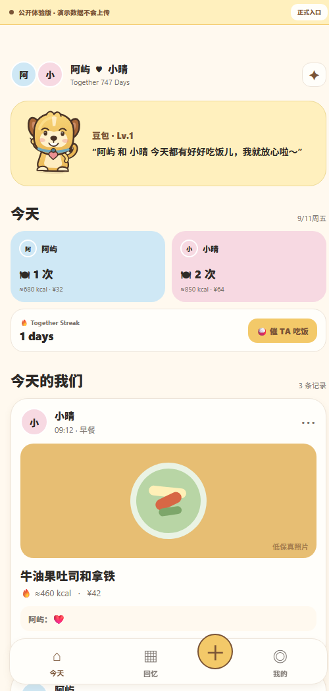

# JSun Bite

一款面向异地情侣的共同饮食记录 App。它不把重点放在专业营养管理，而是用“今天吃了什么”串起两个人的陪伴、互动与共同回忆。

[无需注册，打开公开体验版](https://jsun-bite.expo.app/?demo=1) · [正式登录入口](https://jsun-bite.expo.app)

> iPhone-first · Expo / React Native · Supabase · Doubao Vision



## 产品初衷

异地关系中，很多真实的关心并不是一场长谈，而是“吃饭了吗”“今天吃了什么”。JSun Bite 将这种高频但容易流失的日常，变成双方都能参与的轻量记录。

产品的核心闭环是：

```text
一方发布饮食记录
        ↓
私有云端存储与同步
        ↓
另一方打开即看到更新
        ↓
Reaction / 评论回应
        ↓
沉淀为两个人的月度回忆
```

V0.1 的价值优先级为：**异地陪伴 > 共同回忆 > 趣味互动 > 饮食与花费统计**。

## 已实现功能

| 模块 | 能力 |
| --- | --- |
| 登录与情侣绑定 | 邮箱注册/登录、会话恢复、六位邀请码、一对一情侣空间 |
| Today | 双方今日统计、混合时间线、Together Streak、消息入口、催 TA 吃饭 |
| 饮食记录 | 最多两张照片、餐次/日期/金额/地点/备注、一起吃、编辑和删除 |
| AI 识图 | 用户主动授权后识别整体菜名并粗估热量，结果可修改或删除 |
| 互动 | Reaction、评论、删除自己的评论、互动实时更新 |
| Memories | 月历、照片、Together、搜索筛选、月度次数/金额/热量统计 |
| 个人设置 | 昵称、头像、宠物名、恋爱纪念日、密码与退出登录 |
| 原创宠物“豆包” | 眨眼、说话口型、轻微摆动，以及多种姿势和情绪文案 |
| 公开体验 | 独立演示数据，不读取已有账号、不上传照片，刷新即可重置 |

## 产品与工程亮点

- **完整垂直链路**：从注册绑定、内容发布、私有照片，到互动与回忆，覆盖一个可真实使用的双人产品闭环。
- **隐私优先**：照片存放在 Supabase 私有桶；前端只通过短期签名地址展示；数据库 RLS 将数据范围限制在情侣双方。
- **可靠同步**：优先使用 Supabase Realtime，同时用轻量前台轮询兜底，兼容阻断 WebSocket 的网络环境。
- **一致的数据修改**：编辑或删除记录后，首页次数、月度统计和互动数据会同步重算。
- **受控 AI 调用**：API Key 只保存在 Edge Function Secrets；只有用户明确点击后才会发送第一张图片给视觉模型。
- **安全的作品集入口**：`?demo=1` 强制进入隔离体验模式，即使浏览器保存过正式账号也不会读取真实空间。
- **克制的 V0.1 范围**：没有加入私聊、多好友、地图或复杂宠物游戏，开发始终围绕核心使用链路。

## 技术架构

```text
Expo / React Native Web
  ├─ Auth 与本机会话
  ├─ Today / Add / Detail / Memories / Settings
  └─ Realtime 订阅 + 前台同步兜底
              │
              ▼
Supabase
  ├─ Auth：邮箱身份
  ├─ Postgres：情侣、记录、Reaction、评论、活动
  ├─ Storage：私有照片与头像
  ├─ RLS：情侣级数据隔离
  └─ Edge Functions
       ├─ analyze-meal → 火山方舟视觉模型
       └─ meal-push → Expo Push（原生构建时启用）
```

### 主要技术

- Expo 57 / React Native / React Native Web / TypeScript
- Supabase Auth / Postgres / Realtime / Storage / Edge Functions
- 火山方舟 Doubao 视觉模型
- EAS Hosting / Expo Notifications

## 我的职责与协作方式

这是一个独立产品实践项目。我负责：

- 从真实异地使用场景提出产品方向，确定 V0.1 范围与优先级；
- 持续进行产品决策、交互取舍、服务配置、双账号测试与验收；
- 根据实际使用反馈定位问题，例如注册确认、情侣绑定、数据刷新、资料同步和 AI 延迟；
- 借助 Codex 进行 AI 辅助开发，共同完成界面实现、云端数据链路、调试和部署。

这段协作刻意保留了人的产品判断与验收责任，同时使用 AI 提高原型到可运行产品的迭代速度。

## 本地运行

要求 Node.js 22+，推荐使用 pnpm。

```bash
pnpm install
cp .env.example .env
pnpm web
```

`.env` 示例：

```dotenv
EXPO_PUBLIC_SUPABASE_URL=https://your-project.supabase.co
EXPO_PUBLIC_SUPABASE_PUBLISHABLE_KEY=your-publishable-key
EXPO_PUBLIC_EAS_PROJECT_ID=your-eas-project-uuid
```

不提供 Supabase 配置时，可以使用本地演示数据；线上作品集请直接访问[公开体验版](https://jsun-bite.expo.app/?demo=1)。

常用检查：

```bash
pnpm typecheck
pnpm build:web
pnpm check:live
```

数据库迁移位于 `supabase/migrations/`，Edge Functions 位于 `supabase/functions/`。私有令牌、正式环境变量和本地工具缓存均通过 `.gitignore` 排除。

## 当前状态与边界

当前版本已支持两个人通过网页/PWA 持续使用，公开体验版也已上线。项目暂未提交 App Store；因此日常更新以“打开 App 即同步”为主。原生 Push 代码链路已经预留，但若要在 iPhone 安装包中启用，仍需要 Apple Developer Program、iOS 推送凭据和真机验收。

V0.1 暂不包含私聊、多好友、专业营养建议、地图、复杂宠物养成和 Android 专项适配。

## 隐私说明

- 仓库不包含正式环境变量、Supabase 管理令牌或火山方舟 API Key。
- 公开体验版只使用虚构姓名与演示记录，不连接真实情侣空间。
- 正式版照片为私有存储；AI 识图需要用户单独点击授权。
